<p align="center">
  
</p>

# claude-operator-pass

> Replace a $30K analyst-tool subscription stack with one Operator Pass
> subscription — wrap the JMC tools API for any agent runtime.

The deterministic execution layer for the JMC framework. Cold Email
Linter, EVP Generator, Pipeline Calculator, GEO Visibility Audit,
Competitive Teardown, Paid Media Teardown, and 16+ more — all
server-side, schema-validated, real-result endpoints (not prompts).

Subscriber-gated. Bring your own **[Operator Pass](https://jaymountconsulting.com/operator-pass)**
API key.

[](LICENSE)
[](https://github.com/cmj-hub/claude-operator-pass)


<p align="center">
  
</p>

## What it does

```mermaid
graph LR
    A["/operator-pass"] --> B{Kickoff: state check}
    B -->|No key| C[Show subscribe link]
    B -->|Key + no config| D[Onboarding]
    B -->|Ready| E[Call / List / Schema]
    E --> F[op_api.py<br/>script]
    F --> G[JMC API<br/>22+ tools]

    style C fill:#1a1a2e,stroke:#cc4714
    style F fill:#1a1a2e,stroke:#00d4ff
```



## The 4 sub-skills

| Sub-skill | What it does |
|---|---|
| `operator-pass-kickoff` | Adaptive router — checks env var + key validity + brand-config + quota |
| `operator-pass-onboarding` | First-run setup → validates key, fetches catalog, captures preferred tools + failure handling |
| `operator-pass-call` | Invoke a specific tool by slug — validates inputs against the schema before calling |
| `operator-pass-list` | Live catalog list with slugs + descriptions + per-tool schemas |

## The deterministic script

| Script | Job |
|---|---|
| `scripts/op_api.py` | Zero-dep Python client. Validates `OPERATOR_PASS_API_KEY`. Handles 401/402/429/5xx per brand-config rules. Sub-commands: `whoami`, `list`, `schema <slug>`, `call <slug> --input <json>`. |

Verified:
- Without API key → graceful error + subscribe URL, exit 2
- With key → validates against `/me`, fetches catalog, groups by category

## The 3-tier config

```
brand-config.json   ← API URL + key env var + cache TTLs + preferred tools + quota threshold
SOUL.md             ← Won't-call list + failure handling preferences + quota awareness
AGENTS.md           ← Never call anonymously, never fabricate results, never retry 401/402
```

## Install

### Claude Code

```bash
/plugin marketplace add cmj-hub/claude-operator-pass
/plugin install operator-pass
```

### One-line install

```bash
curl -fsSL https://raw.githubusercontent.com/cmj-hub/claude-operator-pass/main/install.sh | bash
```

### Setup

```bash
# 1. Subscribe + get API key
open https://jaymountconsulting.com/operator-pass

# 2. Set the env var
export OPERATOR_PASS_API_KEY="op_live_..."

# 3. Run onboarding
# (in Claude Code)
> /operator-pass
```

## Usage

```
> Lint this cold email: [paste]
```

→ Routes to `operator-pass-call` → fetches `cold-email-linter` schema
→ validates inputs → POSTs to API → pretty-prints structured response.

```
> What tools are available?
```

→ Routes to `operator-pass-list` → fetches live catalog (cached 5
min) → groups by category.

```
> /operator-pass status
```

→ Shows API key validity + plan + quota + recent calls + cache state.

## Available tools (live catalog)

The catalog is fetched live, so this list is always current. As of
v0.2.0 the API exposes 22+ tools across 4 categories:

### Outbound
- `cold-email-linter` — Per-email score + line-level rewrite
- `linkedin-post-critic` — Critique + 3 rewrites
- `linkedin-hook-grader` — First-line hook scoring
- `nurture-sequence-planner` — 5-email nurture stream

### Foundation
- `evp-generator` — Schwartz-tier EVP variants
- `evp-brief-generator` — Structured 3-tier brief
- `persona-from-crm` — CSV → clusters → PSPs
- `offer-lever-scorer` — 5-lever offer score

### Demand
- `geo-visibility` — URL → AI-visibility 5-dim score
- `competitive-teardown` — URL → 6-bullet teardown
- `paid-media-teardown` — 5-lever ad teardown
- `ad-creative-scorer` — JMC creative framework score
- `pricing-page-lab` — Tiers + decoy → rendered mock

### Revenue
- `cohort-economics-modeler` — LTV/payback/cohort contribution
- `channel-matrix-scorer` — Volume × ACV × Accessibility
- `blended-gtm-dashboard` — 11-slider modeler
- `gtm-architecture-diagrammer` — Canvas + AI coherence audit

Run `/operator-pass list` for the live catalog.

## Cost arbitrage

| Tool stack | $ range | What you'd subscribe to |
|---|---|---|
| Cold-email QA tools (Lemwarm, Mailmeteor, Glock) | ~$200/mo | Email linting + deliverability |
| Competitive intel (Crayon, Klue lite) | $400-1000/mo | Teardowns + battlecards |
| Modeling (custom spreadsheets + Looker seats) | $200-800/mo | Pipeline + cohort math |
| Subject-line testing (Phrasee, Touchstone) | $300+/mo | Subject scoring |

**Total stack**: $1,100-2,200/month = $13K-26K/year for tooling.

**Operator Pass**: $2,400/year flat, 22+ tools, no per-seat pricing.

This skill packages the tools into an agent-callable interface — your
runtime knows how to invoke them as if they were built-in.

## Plugs into

- **[cmj-hub/claude-cold-email](https://github.com/cmj-hub/claude-cold-email)** — `cold-email-linter` validates drafts; `linkedin-hook-grader` scores hooks
- **[cmj-hub/claude-psp](https://github.com/cmj-hub/claude-psp)** — `persona-from-crm` clusters real prospects into PSPs
- **[cmj-hub/claude-evp](https://github.com/cmj-hub/claude-evp)** — `evp-generator` produces variants; `evp-brief-generator` produces briefs

The free framework skills give you the methodology. This API skill
gives you the deterministic execution layer.

## Operator Pass

[Operator Pass](https://jaymountconsulting.com/operator-pass) is the
all-access subscription:

- The full Compounding Engine course catalog (27 courses, 4 modules)
- The 22+ tool API (this skill wraps it)
- Weekly office hours with Jay
- Founder rate $2,400/yr locked through July 16 2026 (100 seats)

## License

MIT (skill code). The API itself is subscription-gated. Built by
[Jay Mount Consulting](https://jaymountconsulting.com).
